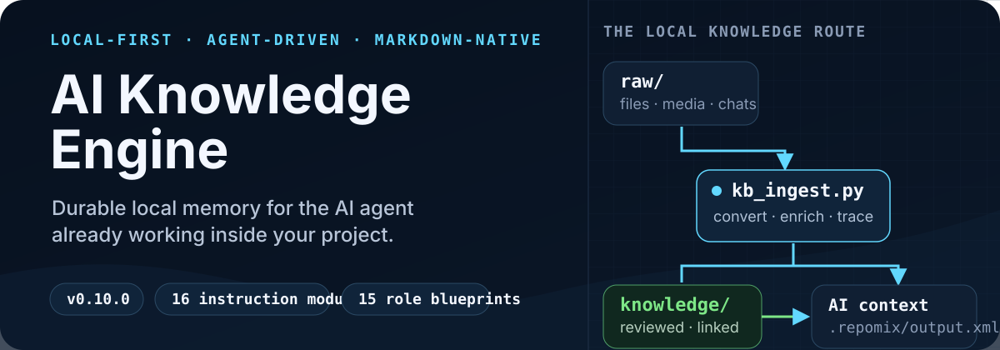
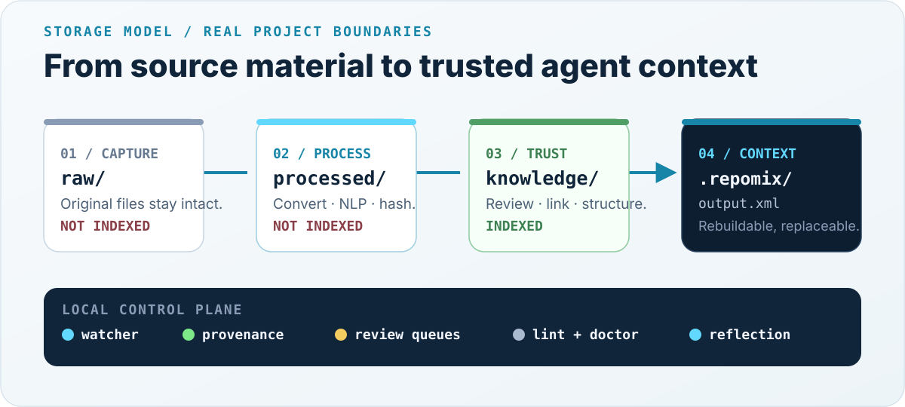

<p align="center">
  
</p>

<p align="center">
  <a href="VERSION"></a>
  <a href="#requirements"></a>
  <a href="LICENSE"></a>
  
</p>

<p align="center">
  <a href="#choose-your-path">Choose a path</a> ·
  <a href="#quick-start">Quick start</a> ·
  <a href="#how-it-works">How it works</a> ·
  <a href="#documentation">Documentation</a> ·
  <a href="i18n/ru/README.md">Русский</a>
</p>

AI assistants are excellent at the current conversation and unreliable at remembering the work around it. **AI Knowledge Engine** is a set of instructions, templates, and reference scripts that gives a Markdown-capable coding agent a durable local memory.

It can start as a compact codebase index or grow into a full knowledge pipeline with document conversion, provenance, NLP enrichment, review queues, health checks, and deliberate AI-assisted reflection. Your files stay in your project; there is no hosted service or database to operate.

## See the system

<p align="center">
  
</p>

The visual above is the actual storage model, not a conceptual cloud architecture:

- `raw/`, `processed/`, `review/`, and `interactions/` stay out of the generated AI index.
- `knowledge/` contains reviewed, reusable Markdown and is safe to index.
- `assets-index/` holds searchable descriptions while original binaries remain private.
- `.repomix/output.xml` is a rebuildable context artifact, not the source of truth.

## Choose your path

| | **Lite — codebase context** | **Full — knowledge engine** |
|---|---|---|
| Start here | [`quick-start/`](quick-start/) | [`knowledge-base/`](knowledge-base/) |
| Best for | Giving an agent a reliable project map | Building a long-lived personal or team knowledge system |
| You get | Domain-pack indexing with token ceilings, secret checks, hardened Git hooks (commit/push/pull) | Raw-first ingest, NLP, provenance, review queues, reflection, linting, watchers |
| Typical setup | About 5 minutes | About 30 minutes |
| Runtime | Repomix + Node.js | Python pipeline + an indexer; Repomix is the included default |

If you only need better code context, start with Lite. Choose Full when decisions, source material, recurring work, or cross-session learning should become durable knowledge.

## Quick start

### Full mode

Copy the deployment kit into the project where the knowledge base should live:

```bash
git clone https://github.com/bionicle12/ai-knowledge-engine.git
cp -R ai-knowledge-engine/knowledge-base /path/to/your-project/setup
cd /path/to/your-project
```

Then send this to your coding agent:

```text
Read setup/README.md and setup/00_OVERVIEW.md, then deploy a
knowledge base for [your role] inside ./knowledge-base/.
When kb_doctor passes, run setup/shell/finalize.sh to flatten
the base into the project root.
```

The agent asks about your role, configures the pipeline, creates a role-specific knowledge structure, verifies it with `kb_doctor.py`, and promotes the finished system to the project root.

<details>
<summary><strong>PowerShell copy command</strong></summary>

```powershell
git clone https://github.com/bionicle12/ai-knowledge-engine.git
Copy-Item -Recurse ai-knowledge-engine\knowledge-base C:\path\to\your-project\setup
Set-Location C:\path\to\your-project
```

</details>

> [!IMPORTANT]
> In every new agent session, begin with: **“Read `AGENTS.md` and use it as the primary instruction for everything that follows.”** The knowledge base is local; the agent must be told where its operating instructions live.

### Lite mode

```bash
npm install -g repomix
cp -R ai-knowledge-engine/quick-start /path/to/your-project/docs/ai-init
```

Then tell your agent:

```text
Read docs/ai-init/INIT_GUIDE.md and initialize the Repomix pack index in this project (mode: init). Show me the proposed pack table before writing any configs.
```

The guide has the agent measure the codebase, cut it into **semantic domain packs** (each under a token ceiling — a single giant `output.xml` stops fitting the context window on real projects), install hardened cross-platform git hooks (commit/push/pull, with PATH bootstrap and logging), and write a short routing table into `AGENTS.md`. The same guide also drives `update` (rebuild only stale packs) and `reinit` (migrate an old monolithic index to packs) — ready-made prompts for all three modes are at the top of the guide.

## Why it is different

### Instructions decide; scripts execute

The project ships two coordinated layers:

1. **Instruction modules** tell the agent what to ask, which choices matter, and how the system should behave.
2. **Reference implementations** handle deterministic work such as ingest, hashing, linting, scheduling, population, and upgrades.

The agent adapts the deployment to your role and project. It does not improvise core pipeline code from scratch.

### Raw first, knowledge last

Original material is preserved before interpretation. Conversion, NLP metadata, provenance, and review happen before anything becomes trusted knowledge. Complex or sensitive material can be routed to review instead of being silently indexed.

### Local work stays local

The baseline pipeline runs on local files and CPU. It does not require a separate SaaS account, database, or pipeline API key. Optional AI operations use the coding agent you already brought to the project.

### The index is replaceable

Repomix works out of the box, but indexing is an adapter boundary. The durable layer is ordinary Markdown plus explicit metadata, links, and provenance.

## How it works

```text
source material
    ↓
raw/                     immutable originals, never indexed
    ↓  kb_ingest.py
processed/               Markdown + extraction metadata, never indexed
    ↓  routing and review
knowledge/               clean linked notes, indexed
assets-index/            searchable descriptions of binary assets
    ↓  context indexer
.repomix/output.xml      rebuildable AI context
```

The pipeline adds five controls around that path:

- **Provenance** — hashes and source references trace knowledge back to its origin.
- **Review queues** — ambiguity, low-confidence conversion, and sensitive material stop for a decision.
- **Health checks** — linting finds stale pages, broken links, orphans, and structural drift.
- **Reflection** — accumulated facts can be synthesized into higher-level insights on a schedule or by command.
- **Upgrades** — `kb_upgrade.py` refreshes reference files while preserving user customizations when possible.

Read the contributor-level [architecture overview](docs/ARCHITECTURE.md) for the full deployment sequence and invariants.

## What Full mode handles

| Capability | What happens locally |
|---|---|
| Documents | PDF, DOCX, PPTX, spreadsheets, and text are converted to Markdown |
| Audio and video | Optional `faster-whisper` transcription; no system FFmpeg required for the default backend |
| Images and scans | Optional `rapidocr-onnxruntime` OCR; Tesseract remains an alternative |
| Archives | ZIP and TAR inputs are unpacked with a size safety cap and re-ingested |
| NLP | Entities, keywords, and routing hints are extracted before AI review |
| Knowledge graph | Markdown pages use `[[wikilinks]]`, routing tables, lifecycle metadata, and provenance |
| Automation | Cross-platform reindexing, watchers, health checks, and importance-based reflection triggers |
| Portability | The complete system is files and folders that can be copied, synced, versioned, or inspected directly |
| Multi-machine | Two deployments of one base exchange knowledge through bundles, with content-hash dedup, fast-forward, and conflicts routed to review |

## Working with the engine

These commands are messages to your AI agent, not shell commands.

| Command | Purpose | Typical AI cost |
|---|---|---:|
| `!view` | Open the local read-only knowledge graph viewer | 0 tokens |
| `!save` | Capture decisions and insights from a productive session | ~2K tokens |
| `!reflect` | Synthesize higher-level patterns from accumulated knowledge | ~15K tokens |
| `!review` | Resolve items waiting in review queues | ~5–30K tokens |
| `!audit` | Deep review for contradictions, gaps, and merge candidates | ~50–100K tokens |
| `!populate` | Regenerate role-specific placement examples | ~50 tokens |
| `!export` | Pack this base into a bundle for another machine | ~100 tokens |
| `!import` | Merge bundles waiting in `sync/inbox/` | ~200 tokens |
| `!merge` | Finish an import: resolve conflicts, audit contradictions, cross-link | ~5–40K tokens |
| `!super on/off` | Switch between Python-first and AI-first operation | 0 tokens |

### Operating modes

| Mode | Behavior | Expected active usage |
|---|---|---:|
| `default` | Python-first processing with throttled AI decisions | ~3–4K tokens/day |
| `super` | AI reasoning for surprise detection, annotations, entity resolution, and frequent review | ~50–200K+ tokens/day |

Token figures are planning estimates, not benchmarks. Actual usage depends on document size, activity, model, and agent behavior.

## Running one base on several machines

Two deployments of the same base drift apart. One laptop accumulates knowledge
about your tools and gear; the other accumulates analysis notes; both edited the
same page last week. Copying folders around loses one side's work, and `rsync`
cannot tell an edit from a stale copy. So the engine ships an explicit merge
path: **export a bundle, import it on the other machine, let the agent settle
what only a human-level reader can settle.** Full contract in
[`16_MERGE.md`](knowledge-base/16_MERGE.md).

```text
   machine A                              machine B
┌──────────────┐                       ┌──────────────┐
│  knowledge/  │                       │  knowledge/  │
└──────┬───────┘                       └──────▲───────┘
       │ export                               │ import
       ▼                                      │
 sync/outbox/bundle.zip ───── copy ─────► sync/inbox/bundle.zip
                                              │
                                              ├─ safe cases → applied automatically
                                              └─ ambiguous  → review/needs-merge/
                                                                    │
                                                              !merge (agent)
```

### One-time setup

Each machine needs its own name. Open `kb.config.yml` on both and set a
**different** `sync.label` — it is stamped onto every page that travels, which
is what makes a merge traceable later:

```yaml
sync:
  label: "studio-laptop"     # on the other machine: "work-laptop"
```

If your bases were deployed before this feature existed, pull it in with the
upgrader (see [Updating deployed knowledge bases](#updating-deployed-knowledge-bases)) —
it adds the scripts, the launchers, the `sync/` folder and the config section,
defaulting `label` to the base's folder name.

### Step 1 — export on the machine that has new knowledge

| OS | How |
|---|---|
| **macOS** | Double-click `export.command` |
| **Windows** | Double-click `export.bat` |
| **Linux / any terminal** | `./shell/export.sh` |
| **In the AI chat** | `!export` |

A file appears in `sync/outbox/`:
`kb-bundle__studio-laptop__2026-07-31.zip`

Useful flags (append them in the terminal, or ask the agent):

```bash
./shell/export.sh --since 2026-06-01    # only knowledge touched since a date
./shell/export.sh --with-assets         # include the binary originals too
./shell/export.sh --only knowledge      # knowledge pages and nothing else
./shell/export.sh --dry-run             # show what would be packed
```

### Step 2 — move the file

Copy that one `.zip` into the other machine's `sync/inbox/` folder — USB stick,
cloud folder, `scp`, anything. Nothing here touches the network on its own.

### Step 3 — import there

| OS | How |
|---|---|
| **macOS** | Double-click `import.command` |
| **Windows** | Double-click `import.bat` |
| **Linux / any terminal** | `./shell/import.sh` |
| **In the AI chat** | `!import` |

Every bundle sitting in `sync/inbox/` is processed. You get a summary in the
terminal and a full report in `sync/reports/`.

### Step 4 — `!merge` in the AI chat

```
Read AGENTS.md and use it as the primary instruction for everything that follows.
!merge
```

The agent resolves each queued conflict by folding the two versions together —
keeping every fact that is true in either — records genuine contradictions in
`knowledge/open-questions/` with both sources instead of silently picking a
winner, cross-links the imported pages into the existing graph, refreshes
routing, lints and reindexes.

Run the same four steps in the other direction and both machines hold the union
of the knowledge.

### What the importer decides on its own

It only does what is provably safe and leaves judgement to the agent:

| Situation | What happens |
|---|---|
| Page exists only in the bundle | Added, stamped with `merged_from:` provenance |
| Same content, same place | Skipped |
| Same content, richer metadata | Tags, counters and missing fields merged; body untouched |
| Same content under a different name | Skipped, reported as a duplicate |
| Local copy untouched since the last import | Fast-forwarded, previous version backed up |
| Changed on **both** machines | Local file untouched; incoming version + diff queued in `review/needs-merge/` |
| Different name, ~85%+ overlap | Added, plus a merge-candidate note for consolidation |

Two pages count as the same knowledge when their **bodies** match; frontmatter is
bookkeeping and merges instead of conflicting, so simply reading a page on one
machine never looks like an edit on the other. Re-importing the same bundle
changes nothing.

### Safety and privacy

- **Nothing is overwritten silently.** Every file the import touches is copied to
  `sync/backups/<timestamp>/` first.
- **Bundles carry knowledge, not raw material.** `raw/`, `processed/`, `review/`
  and `sync/` never travel. Binary assets are opt-in via `--with-assets`; without
  them the imported `assets-index/` entries are annotated as "original file not
  present in this base" rather than left dangling.
- **`sync/` is excluded** from the AI index and from git.
- `--dry-run` classifies everything and writes nothing.
- Sharing the base with someone else? Export with `--only knowledge` and read the
  result first — `interactions/` holds session history and the provenance
  metadata holds original filenames.

### If something looks stuck

| Symptom | What it means |
|---|---|
| Import printed "N conflicts waiting" | Normal. Say `!merge` in the AI chat. |
| Import exits with code `1` | Same thing — `1` means "merged, conflicts queued", not a failure. |
| "No bundle to import" | The `.zip` is not in `sync/inbox/` on **this** machine. |
| Both machines produce identically named bundles | Their `sync.label` is the same. Give each its own. |
| Want to check before committing to it | Run the import with `--dry-run`. |

## Updating deployed knowledge bases

Always run the upgrader from your current `ai-knowledge-engine` checkout. Start
with `--dry-run`; remove it only after reviewing the plan.

### Windows

```powershell
python C:\path\to\ai-knowledge-engine\scripts\kb_upgrade.py `
  --kb-root C:\path\to\kb-name --dry-run
python C:\path\to\ai-knowledge-engine\scripts\kb_upgrade.py `
  --kb-root C:\path\to\kb-name
```

### macOS

```bash
python3 ~/path/to/ai-knowledge-engine/scripts/kb_upgrade.py \
  --kb-root ~/path/to/kb-name --dry-run
python3 ~/path/to/ai-knowledge-engine/scripts/kb_upgrade.py \
  --kb-root ~/path/to/kb-name
```

### Linux

```bash
python3 /path/to/ai-knowledge-engine/scripts/kb_upgrade.py \
  --kb-root /path/to/kb-name --dry-run
python3 /path/to/ai-knowledge-engine/scripts/kb_upgrade.py \
  --kb-root /path/to/kb-name
```

The first upgrade installs `scripts/kb_update.py` into the KB. After that,
run `python scripts/kb_update.py --dry-run` (Windows) or
`python3 scripts/kb_update.py --dry-run` (macOS/Linux) from the KB root. The
launcher finds the source repo automatically; use `--repo-root PATH` or
`AI_KNOWLEDGE_ENGINE_HOME` when it lives elsewhere.

For a directory of bases, use
`--all-root /path/to/parent` (immediate `kb-*` children). If a file is truly
safe to replace, prefer repeatable `--accept FILE` over global `--force`.
See [the upgrading guide](docs/UPGRADING.md) for examples and safety rules.

## Role blueprints

Full mode includes 15 starting configurations in [`knowledge-base/examples/`](knowledge-base/examples/):

| Template | Role | Focus |
|---|---|---|
| [`b2b-strategic-product-owner.yml`](knowledge-base/examples/b2b-strategic-product-owner.yml) | B2B Strategic Product Owner | SaaS strategy, roadmaps, risks, sales-ready PRDs |
| [`battle-rap-producer.yml`](knowledge-base/examples/battle-rap-producer.yml) | Battle rap producer & lyricist | Lyric craft, punchlines, vocal stacks, mixing, battle prep |
| [`content-creator.yml`](knowledge-base/examples/content-creator.yml) | Content creator | Voice, audience, formats, publishing, monetization |
| [`creative-hybrid.yml`](knowledge-base/examples/creative-hybrid.yml) | Creative Hybrid | Software, music production, indie game development |
| [`fiction-writer.yml`](knowledge-base/examples/fiction-writer.yml) | Fiction writer | Craft theory, voice studies, story development, draft critique |
| [`founder.yml`](knowledge-base/examples/founder.yml) | Startup founder | Product, investors, hiring, decisions, company building |
| [`marketing-director.yml`](knowledge-base/examples/marketing-director.yml) | Marketing Director | Strategy, brand, campaigns, audience analysis |
| [`music-video-director.yml`](knowledge-base/examples/music-video-director.yml) | Music video writer-director | Treatments, production, shot planning, edit rhythm |
| [`product-manager.yml`](knowledge-base/examples/product-manager.yml) | Product Manager | Prioritization, metrics, research, product requirements |
| [`programmer-senior.yml`](knowledge-base/examples/programmer-senior.yml) | Senior Software Engineer | Architecture, debugging, stack knowledge, engineering principles |
| [`psychologist-gestalt.yml`](knowledge-base/examples/psychologist-gestalt.yml) | Gestalt-oriented psychologist | Ethics, anonymized cases, supervision, interventions |
| [`researcher.yml`](knowledge-base/examples/researcher.yml) | Researcher / Analyst | Literature, hypotheses, evidence, methodology |
| [`russian-software-engineering-student.yml`](knowledge-base/examples/russian-software-engineering-student.yml) | Software engineering student in Russia | Coursework, labs, exams, internships |
| [`startup-opportunity-explorer.yml`](knowledge-base/examples/startup-opportunity-explorer.yml) | Startup Opportunity Explorer | Market gaps, validation, idea scoring, web-app MVPs |
| [`viral-short-form-veo.yml`](knowledge-base/examples/viral-short-form-veo.yml) | Viral short-form video director | Hooks, storyboards, Veo 3 prompt chains, ad learning |

A role file defines useful entities, folder routes, placement examples, recurring queries, and review priorities. If none fits, the deployment agent can derive a custom configuration from your work.

## AI Skills Fixer

The repository also ships `tools/ai-skills-fixer/` — a standalone tool that
curates AI agent skills across Claude Code, Codex, Cursor, and Antigravity.
It inventories installed skills with provenance (which repository and commit
each copy came from), audits prompt debt, and reconciles every environment
to one declarative profile of pinned skill releases, so all your machines
run the same up-to-date skill set. Design:
[the specification](docs/superpowers/specs/2026-08-19-ai-skills-fixer-design.md);
agent entry point: [SKILL.md](tools/ai-skills-fixer/SKILL.md).

Requirements: Python 3.10+, PyYAML, git 2.30+. Nothing mutating runs without
an explicitly approved plan ID; every change is backed up and reversible.

```bash
# one-time setup on a machine
python3 tools/ai-skills-fixer/scripts/run.py init
python3 tools/ai-skills-fixer/scripts/run.py source add <skill-repo-url-or-path>

# see what is installed and where it came from
python3 tools/ai-skills-fixer/scripts/run.py inventory

# decide what you keep (repeat per skill, or let your agent run the questionnaire)
python3 tools/ai-skills-fixer/scripts/run.py profile set <source>:<skill> enabled \
    --targets claude codex cursor antigravity

# dry run, review the exact plan, then apply it by ID
python3 tools/ai-skills-fixer/scripts/run.py reconcile --prune
python3 tools/ai-skills-fixer/scripts/run.py reconcile --apply <plan-id>

# update skills to a new upstream version later
python3 tools/ai-skills-fixer/scripts/run.py source refresh
python3 tools/ai-skills-fixer/scripts/run.py source promote <source-id>
python3 tools/ai-skills-fixer/scripts/run.py reconcile --prune   # then --apply <plan-id>

# undo any apply, byte-for-byte
python3 tools/ai-skills-fixer/scripts/run.py rollback <apply-id>
```

The managed store lives in a sibling `skill-repositories/` directory
(override with `--store-root` or `AI_SKILLS_FIXER_STORE_ROOT`); the machine
id defaults to the hostname. To reuse your skill policy on another PC:
clone this repository there, run `init`, `source add` the same skill
repositories, copy `profiles/default.yml` from your other machine's store,
then `reconcile --prune` and apply. `--prune` quarantines (recoverably)
every exact source copy your profile does not keep, which is how one
machine converges to the same skill set as the others.

## Project map

```text
ai-knowledge-engine/
├── quick-start/                 Lite mode: codebase indexing guide
├── knowledge-base/
│   ├── 00_…16_*.md             17 ordered instruction modules
│   ├── scripts/                Python reference pipeline and tests
│   ├── shell/                  macOS/Linux wrappers + Windows launchers
│   ├── templates/              config, agent, structure, and dependency templates
│   └── examples/               15 role blueprints
├── scripts/                    upgrades, translation checks, repository maintenance
├── tools/ai-skills-fixer/      cross-IDE AI skill inventory, audit, and reconciliation
├── i18n/ru/                    Russian documentation and instruction set
└── docs/                       architecture, troubleshooting, upgrades, roadmap
```

## Requirements

| Component | Minimum | Needed for |
|---|---:|---|
| Python | 3.11+ | Full-mode ingest, NLP, linting, watchers, and health checks |
| Node.js | 20+ | Included Repomix indexer |
| Git | Any recent version | Versioning and optional hooks |
| AI coding agent | Markdown + file and shell access | Guided deployment and AI-assisted commands |

Core Python dependencies are listed in [`requirements.txt`](knowledge-base/templates/requirements.txt). Speech-to-text and OCR are deliberately separated into [`requirements-media.txt`](knowledge-base/templates/requirements-media.txt).

The instructions are designed for Claude, Codex, GPT, Gemini, Cursor, and other Markdown-capable agents that can inspect files and run commands. Exact behavior still depends on the host application's permissions and tool access.

## Limits and trust boundaries

- This repository is a deployment template, not a hosted application or sync service.
- The agent does not remember the knowledge base automatically; each new session must load `AGENTS.md`.
- Local-first storage protects against an external service by default, but repository permissions, backups, and model-provider data policies remain your responsibility.
- Repomix security checks reduce accidental secret inclusion; they are not a replacement for secret management or a security audit.
- AI review and reflection can be expensive in `super` mode and should be enabled deliberately.

## Documentation

| Need | Read |
|---|---|
| Understand the full deployment | [`knowledge-base/README.md`](knowledge-base/README.md) |
| See system architecture | [`docs/ARCHITECTURE.md`](docs/ARCHITECTURE.md) |
| Fix a failed setup | [`docs/TROUBLESHOOTING.md`](docs/TROUBLESHOOTING.md) |
| Upgrade a deployed base | [`docs/UPGRADING.md`](docs/UPGRADING.md) |
| Merge two machines' bases | [`knowledge-base/16_MERGE.md`](knowledge-base/16_MERGE.md) |
| Maintain or contribute | [`docs/MAINTENANCE.md`](docs/MAINTENANCE.md) and [`docs/CONTRIBUTING.md`](docs/CONTRIBUTING.md) |
| Translate the project | [`docs/TRANSLATING.md`](docs/TRANSLATING.md) |
| Review planned work | [`docs/ROADMAP.md`](docs/ROADMAP.md) |
| Read in Russian | [`i18n/ru/README.md`](i18n/ru/README.md) |

## Development

Install the test dependencies and run the suite locally:

```bash
python -m pip install -r knowledge-base/templates/requirements-dev.txt
python -m pytest
```

On Windows, tests for POSIX launchers require a working WSL environment, and the finalize-script fixtures require permission to create symbolic links. The Python pipeline tests run natively.

Contributions are welcome, especially new role blueprints, clearer instruction modules, cross-platform fixes, translations, and pipeline tests. For substantial changes, open an issue first and follow the [contribution guide](docs/CONTRIBUTING.md).

## Acknowledgements

- Thanks for the inspiration — [this talk](https://www.youtube.com/watch?v=LKHLN3UffmQ)
- Thanks for the food for thought — [escaped_ai](https://boosty.to/escaped_ai)
- Thanks for simply existing — [Andrej Karpathy](https://x.com/karpathy)

## Support the author

If you would like to help me survive in this world — visit
[github.com/bionicle12](https://github.com/bionicle12/).

## License

[MIT](LICENSE) — use it for personal or commercial work.

<p align="center">
  <strong>Build knowledge your agent can find, verify, and carry forward.</strong>
</p>
