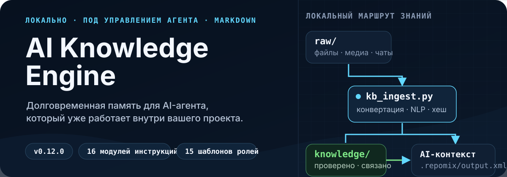
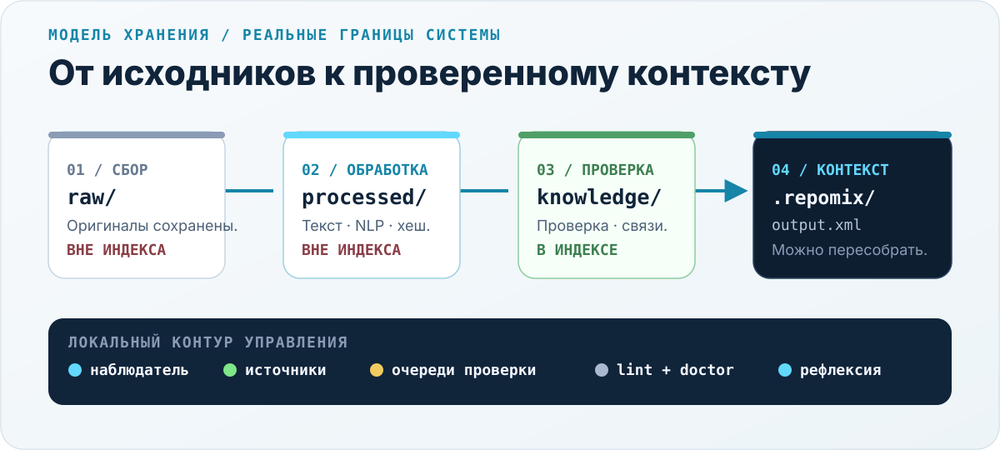

<p align="center">
  
</p>

<p align="center">
  <a href="../../VERSION"></a>
  <a href="#требования"></a>
  <a href="../../LICENSE"></a>
  
</p>

<p align="center">
  <a href="#выберите-свой-режим">Выбрать режим</a> ·
  <a href="#быстрый-старт">Быстрый старт</a> ·
  <a href="#как-это-работает">Как это работает</a> ·
  <a href="#документация">Документация</a> ·
  <a href="../../README.md">English</a>
</p>

AI-ассистенты отлично работают с текущим диалогом, но ненадёжно помнят всё, что происходило вокруг него. **AI Knowledge Engine** — это набор инструкций, шаблонов и эталонных скриптов, который даёт Markdown-совместимому coding agent долговременную локальную память.

Система может начать с компактного индекса кодовой базы, а затем вырасти в полноценный конвейер знаний с конвертацией документов, provenance, NLP-обогащением, очередями проверки, health checks и осознанной AI-рефлексией. Файлы остаются внутри вашего проекта; отдельный облачный сервис или база данных не нужны.

## Посмотрите на систему

<p align="center">
  
</p>

На схеме показана реальная модель хранения, а не условная облачная архитектура:

- `raw/`, `processed/`, `review/` и `interactions/` не попадают в сгенерированный AI-индекс.
- `knowledge/` содержит проверенный, повторно используемый Markdown, который разрешено индексировать.
- `assets-index/` хранит доступные для поиска описания, пока исходные бинарные файлы остаются приватными.
- `.repomix/output.xml` — пересобираемый артефакт контекста, а не источник истины.

## Выберите свой режим

| | **Lite — контекст кодовой базы** | **Full — движок знаний** |
|---|---|---|
| Начать здесь | [`quick-start/`](../../quick-start/) | [`knowledge-base/`](../../knowledge-base/) |
| Подходит для | Надёжной карты проекта для AI-агента | Долговременной персональной или командной системы знаний |
| Что вы получите | Индексацию с учётом стека, проверку секретов, контроль токенов, необязательный Git hook | Raw-first ingest, NLP, provenance, очереди проверки, рефлексию, linting и watchers |
| Обычное время настройки | Около 5 минут | Около 30 минут |
| Среда выполнения | Repomix + Node.js | Python-конвейер + индексатор; Repomix включён по умолчанию |

Если нужен только более качественный контекст кода, начните с Lite. Выбирайте Full, когда решения, исходные материалы, повторяющаяся работа или накопленный между сессиями опыт должны стать долговременными знаниями.

## Быстрый старт

### Полный режим

Скопируйте комплект развёртывания в проект, где должна жить база знаний:

```bash
git clone https://github.com/bionicle12/ai-knowledge-engine.git
cp -R ai-knowledge-engine/knowledge-base /path/to/your-project/setup
cd /path/to/your-project
```

Затем отправьте coding agent следующий запрос:

```text
Прочитай setup/README.md и setup/00_OVERVIEW.md, затем разверни
базу знаний для [вашей роли] внутри ./knowledge-base/.
Когда kb_doctor завершится успешно, запусти setup/shell/finalize.sh,
чтобы перенести готовую базу в корень проекта.
```

Агент уточнит вашу роль, настроит конвейер, создаст подходящую структуру знаний, проверит её через `kb_doctor.py` и перенесёт готовую систему в корень проекта.

<details>
<summary><strong>Команды копирования для PowerShell</strong></summary>

```powershell
git clone https://github.com/bionicle12/ai-knowledge-engine.git
Copy-Item -Recurse ai-knowledge-engine\knowledge-base C:\path\to\your-project\setup
Set-Location C:\path\to\your-project
```

</details>

> [!IMPORTANT]
> Каждую новую сессию с агентом начинайте с фразы: **«Прочитай `AGENTS.md` и используй его как основную инструкцию для всего, что последует дальше».** База знаний локальна, поэтому агенту нужно явно указать, где находятся его рабочие инструкции.

### Режим Lite

```bash
npm install -g repomix
cp -R ai-knowledge-engine/quick-start /path/to/your-project/docs/ai-init
```

Затем скажите агенту:

```text
Прочитай docs/ai-init/INIT_GUIDE.md и настрой индексацию контекста для этого проекта.
```

Гайд проведёт агента через анализ стека, безопасные include/exclude-паттерны, проверку секретов Repomix и создание первого снимка контекста.

## Чем система отличается

### Инструкции принимают решения, скрипты выполняют

Проект поставляет два согласованных слоя:

1. **Модули инструкций** объясняют агенту, что спросить, какие решения важны и как должна вести себя система.
2. **Эталонные реализации** выполняют детерминированную работу: ingest, хеширование, linting, планирование, начальное заполнение и обновления.

Агент адаптирует развёртывание под вашу роль и проект, но не импровизирует основной код конвейера с нуля.

### Сначала исходники, затем знания

Оригинальные материалы сохраняются до любой интерпретации. Конвертация, NLP-метаданные, provenance и проверка происходят до того, как информация станет доверенным знанием. Сложные или чувствительные материалы можно отправить в очередь проверки вместо автоматической индексации.

### Локальная работа остаётся локальной

Базовый конвейер работает с локальными файлами и CPU. Для него не нужны отдельный SaaS-аккаунт, база данных или API-ключ конвейера. Необязательные AI-операции используют coding agent, с которым вы уже работаете в проекте.

### Индексатор можно заменить

Repomix работает из коробки, но индексатор находится за отдельной границей адаптера. Долговременный слой — это обычный Markdown с явными метаданными, ссылками и provenance.

## Как это работает

```text
исходные материалы
    ↓
raw/                     неизменяемые оригиналы, не индексируются
    ↓  kb_ingest.py
processed/               Markdown + метаданные извлечения, не индексируются
    ↓  маршрутизация и проверка
knowledge/               чистые связанные заметки, индексируются
assets-index/            доступные для поиска описания бинарных файлов
    ↓  индексатор контекста
.repomix/output.xml      пересобираемый AI-контекст
```

Вокруг этого маршрута работают пять механизмов контроля:

- **Provenance** — хеши и ссылки на источники связывают знания с их происхождением.
- **Очереди проверки** — неоднозначные, неуверенно распознанные и чувствительные материалы останавливаются до принятия решения.
- **Health checks** — linting находит устаревшие страницы, битые ссылки, сироты и отклонения структуры.
- **Рефлексия** — накопленные факты можно синтезировать в более общие выводы по расписанию или команде.
- **Обновления** — `kb_upgrade.py` обновляет эталонные файлы и по возможности сохраняет пользовательские изменения.

Полная последовательность развёртывания и системные инварианты описаны в [обзоре архитектуры](../../docs/ARCHITECTURE.md).

## Что умеет Full mode

| Возможность | Что происходит локально |
|---|---|
| Документы | PDF, DOCX, PPTX, таблицы и текст конвертируются в Markdown |
| Аудио и видео | Необязательная транскрипция через `faster-whisper`; системный FFmpeg для backend по умолчанию не нужен |
| Изображения и сканы | Необязательный OCR через `rapidocr-onnxruntime`; Tesseract остаётся альтернативой |
| Архивы | ZIP- и TAR-архивы распаковываются с ограничением размера и повторно отправляются в ingest |
| NLP | Сущности, ключевые слова и подсказки маршрутизации извлекаются до AI-проверки |
| Граф знаний | Markdown-страницы используют `[[wikilinks]]`, routing tables, lifecycle-метаданные и provenance |
| Автоматизация | Кроссплатформенная переиндексация, watchers, health checks и триггеры рефлексии по важности |
| Переносимость | Вся система состоит из файлов и папок, которые можно копировать, синхронизировать, версионировать и проверять напрямую |

## Работа с движком

Следующие команды отправляются AI-агенту как сообщения, а не выполняются в shell.

| Команда | Назначение | Обычная стоимость AI |
|---|---|---:|
| `!save` | Сохранить решения и инсайты продуктивной сессии | ~2K токенов |
| `!reflect` | Синтезировать общие закономерности из накопленных знаний | ~15K токенов |
| `!review` | Разобрать материалы, ожидающие решения в очередях проверки | ~5–30K токенов |
| `!audit` | Провести глубокую проверку противоречий, пробелов и кандидатов на объединение | ~50–100K токенов |
| `!populate` | Пересоздать примеры размещения материалов под выбранную роль | ~50 токенов |
| `!super on/off` | Переключить Python-first и AI-first режимы | 0 токенов |

### Рабочие режимы

| Режим | Поведение | Ожидаемый расход при активной работе |
|---|---|---:|
| `default` | Python-first обработка с ограниченными AI-решениями | ~3–4K токенов/день |
| `super` | AI-анализ новизны, аннотаций, сущностей и частых проверок | ~50–200K+ токенов/день |

Числа приведены для планирования и не являются бенчмарками. Реальный расход зависит от объёма документов, активности, модели и поведения агента.

## Ролевые шаблоны

Full mode включает 15 стартовых конфигураций в [`knowledge-base/examples/`](../../knowledge-base/examples/), среди них:

- software engineer, product manager, founder, researcher и marketing director;
- content creator, fiction writer, music-video director и viral short-form director;
- B2B product owner, startup opportunity explorer, psychologist и software engineering student.

Файл роли задаёт полезные сущности, маршруты папок, примеры размещения, повторяющиеся запросы и приоритеты проверки. Если готового варианта нет, агент развёртывания может создать пользовательскую конфигурацию на основе вашей работы.

## Карта проекта

```text
ai-knowledge-engine/
├── quick-start/                 Lite mode: гайд по индексации кодовой базы
├── knowledge-base/
│   ├── 00_…15_*.md             16 последовательных модулей инструкций
│   ├── scripts/                эталонный Python-конвейер и тесты
│   ├── shell/                  macOS/Linux wrappers + Windows launchers
│   ├── templates/              шаблоны конфигов, агента, структуры и зависимостей
│   └── examples/               15 ролевых шаблонов
├── scripts/                    обновления, проверка переводов, обслуживание репозитория
├── i18n/ru/                    русская документация и набор инструкций
└── docs/                       архитектура, troubleshooting, обновления, roadmap
```

## Требования

| Компонент | Минимум | Для чего нужен |
|---|---:|---|
| Python | 3.11+ | Full-mode ingest, NLP, linting, watchers и health checks |
| Node.js | 20+ | Включённый индексатор Repomix |
| Git | Любая современная версия | Версионирование и необязательные hooks |
| AI coding agent | Доступ к Markdown, файлам и shell | Управляемое развёртывание и AI-команды |

Основные зависимости Python перечислены в [`requirements.txt`](../../knowledge-base/templates/requirements.txt). Speech-to-text и OCR намеренно вынесены в отдельный [`requirements-media.txt`](../../knowledge-base/templates/requirements-media.txt).

Инструкции рассчитаны на Claude, Codex, GPT, Gemini, Cursor и других Markdown-совместимых агентов, которые умеют просматривать файлы и запускать команды. Конкретное поведение всё равно зависит от разрешений и доступных инструментов host-приложения.

## Ограничения и границы доверия

- Этот репозиторий — шаблон развёртывания, а не hosted-приложение или сервис синхронизации.
- Агент не запоминает базу автоматически: каждая новая сессия должна загрузить `AGENTS.md`.
- Local-first хранение по умолчанию не отправляет данные во внешний сервис, но права репозитория, резервные копии и политика model provider остаются вашей ответственностью.
- Проверка секретов Repomix снижает риск случайной индексации секретов, но не заменяет secret management или security audit.
- AI-проверка и рефлексия в режиме `super` могут быть дорогими и должны включаться осознанно.

## Документация

| Задача | Что читать |
|---|---|
| Развернуть полную систему | [`knowledge-base/README.md`](../../knowledge-base/README.md) |
| Понять архитектуру | [`docs/ARCHITECTURE.md`](../../docs/ARCHITECTURE.md) |
| Исправить ошибку настройки | [`docs/TROUBLESHOOTING.md`](../../docs/TROUBLESHOOTING.md) |
| Обновить развёрнутую базу | [`docs/UPGRADING.md`](../../docs/UPGRADING.md) |
| Поддерживать проект или внести вклад | [`docs/MAINTENANCE.md`](../../docs/MAINTENANCE.md) и [`docs/CONTRIBUTING.md`](../../docs/CONTRIBUTING.md) |
| Перевести проект | [`docs/TRANSLATING.md`](../../docs/TRANSLATING.md) |
| Посмотреть планы | [`docs/ROADMAP.md`](../../docs/ROADMAP.md) |
| Читать на английском | [`README.md`](../../README.md) |

## Разработка

Установите тестовые зависимости и запустите suite локально:

```bash
python -m pip install -r knowledge-base/templates/requirements-dev.txt
python -m pytest
```

В Windows тестам POSIX-launchers требуется рабочее окружение WSL, а fixtures для finalize-script — разрешение на создание символических ссылок. Тесты Python-конвейера работают нативно.

Приветствуются новые ролевые шаблоны, более ясные модули инструкций, кроссплатформенные исправления, переводы и pipeline tests. Перед существенными изменениями откройте issue и следуйте [руководству для контрибьюторов](../../docs/CONTRIBUTING.md).

## Лицензия

[MIT](../../LICENSE) — свободно для личного и коммерческого использования.

<p align="center">
  <strong>Создавайте знания, которые агент сможет найти, проверить и использовать дальше.</strong>
</p>
